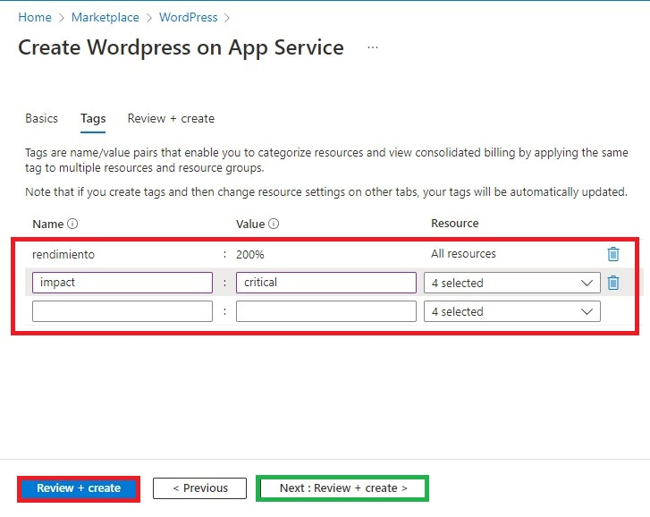

 Lo primero que se necesita es tener una cuenta de azure e ingresar al [Portal de Azure](portal.azure.com)

 Una vez estando dentro del portal en la barra de busqueda ingresamos: Marketplace

 Dentro de la tienda o Marketplace buscaremos los servicios de WordPress, hay varios pero elegimos el que se muestra en la imagen

 En la siguiente pantalla se te aparecera algo como la que muestro, en el plan no hay que modificarle nada, se queda como WordPress y damos click en create o crear.

 Posteriormente nos mostrará la siguiente pantalla, en la cual elegimos nuestra suscripcion (esta normalmente solo se tiene una), el grupo del recurso (este puedes elegir uno de los que ya tengas o en ser caso de que es tu primera vez puedes crear uno nuevo), la region (recuerda siempre elegir el la region que esté mas cercana a ti), el nombre (este puede ser el que tu quieras) y el sistema operativo, de preferencia y si eres principiante, selecciona Windows.

 Le damos click en Siguiente: Etiquetas

Las etiquetas son opcionales estos las puedes usar para priorizar tus recursos, en este ejemplo utilice la de rendimiento e impacto. Los valores pueden ser los que tu quieras.
Para continuar damos click en cualquiera de los botones que dicen Review + Create

Posteriormente mostrará los datos que ingresamos solo para confirmar y damos click en Create.

Al darle click se empezará a desplegar nuestra pagina en Azure y nos mostrará una imagen como la siguiente:

Tendrá que dejar que pase un tiempo para que se carguen los recursos, tal vez entre 2 a 5 min dependiendo la zona que se elija.

Seleccionamos la opcion de ir a recurso y nos mostrará lo siguiente.

Al darle click al botón de Browse o al link de nuestro sitio nos llevara al sitio de WordPress donde solo necesitamos seguir las intrucciones de WordPress para instalar WordPress a nuestro sitio.

En caso de querer borrar o detener el sitio le puede click en detener o borrar el servicio.

